# ponder

A Vulkan path tracer built around a full OpenPBR material model. Every image
below is produced by the unit-test suite (`unit-test/output/`) — scene renders
are validation artifacts, heatmaps are the visual output of the statistical
and numerical checks each BSDF lobe went through.

# TODO
- vdb:
 - HDDA to skip empty space in vdb blobs
 - fp16 vdb grids
 - vdb grid placement transform
 - multiple vdb blobs
 - per-blob albedo, sigma, droplet size
 - additional vdb grid imports
- surface path-tracer:
 - openpbr SSS lobe
 - scene light NEE (currently only environment light NEE)
- rasterizer:
 - port old gpu occlusion culling
 - port old ddgi probes, maybe update to ReSTIR?
 - maybe implement LOD selection?
- overall:
 - need a better tonemapper/hdr system
 - need bloom (maybe?)
 - need denoiser

## Cornell box — OpenPBR material sweep

Full ported OpenPBR chain (lobe selection → sample → evaluate/pdf), two
rotated boxes on real TLAS instance transforms.

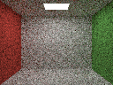
*Reference: hand-rolled Lambertian path tracer.*

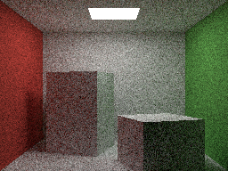
*Agreement check: the same walls expressed as OpenPBR surfaces — color bleed and falloff match the reference.*

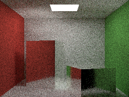
*Near-smooth silver mirror.*

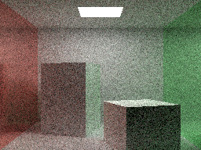
*Mirror walls — multi-bounce specular interreflection.*

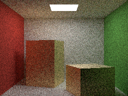
*Brushed gold — anisotropic metal.*

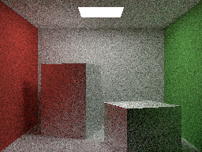
*Anisotropic roughness with differing tangent orientation per box.*

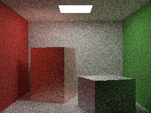
*Copper vs. steel — F82 metallic base-color tint.*

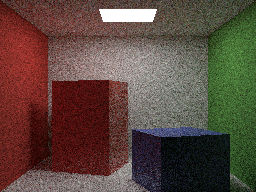
*Colored glossy-diffuse (paint-like) surfaces.*

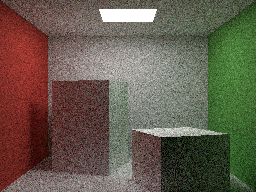
*Smooth plastic — dielectric specular over diffuse base.*

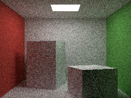
*Rough plastic.*

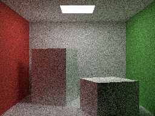
*Specular IOR sweep — high vs. low index side by side.*

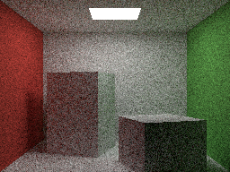
*EON rough-diffuse roughness (σ) sweep.*

## Glass & instancing scenes

Medium-tracking path tracer: nested dielectrics, hollow shells, TLAS at scale.

*Nested dielectrics: thin shell (η 1.05) around a dense core (η 2.40).*

*Dense shell (η 2.40) around a barely-there core (η 1.05).*

*Glass shell (η 1.50) around a water core (η 1.33).*

*Matched IOR, tinted core — confirms color and bend angle vary independently.*

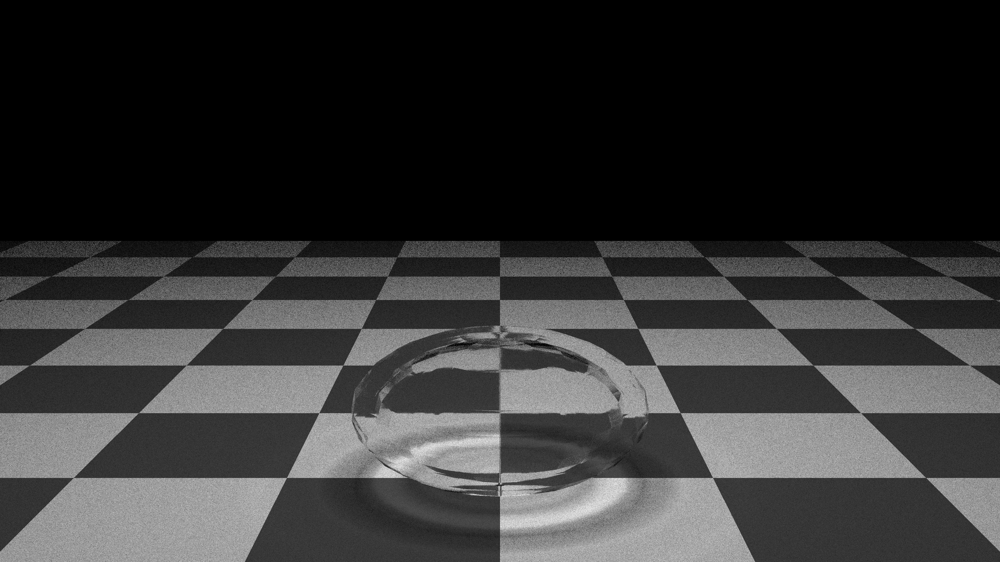
*Hollow shell over a checkerboard, η 1.05 — barely bends.*

*Same shell at water's index, η 1.33.*

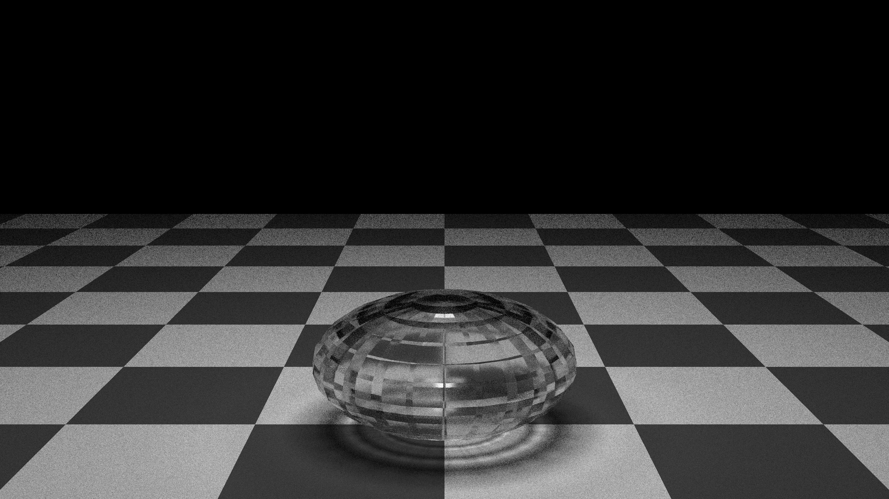
*Ordinary glass, η 1.50.*

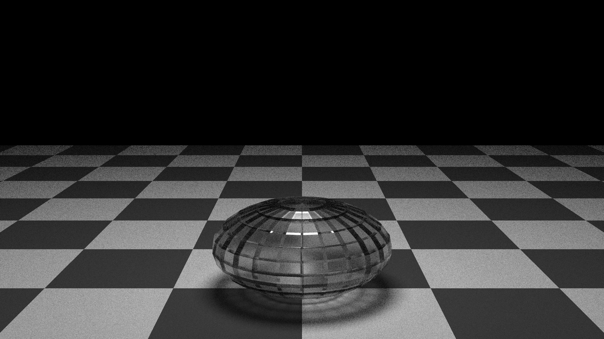
*Diamond, η 2.40 — strongest refraction and internal reflection.*

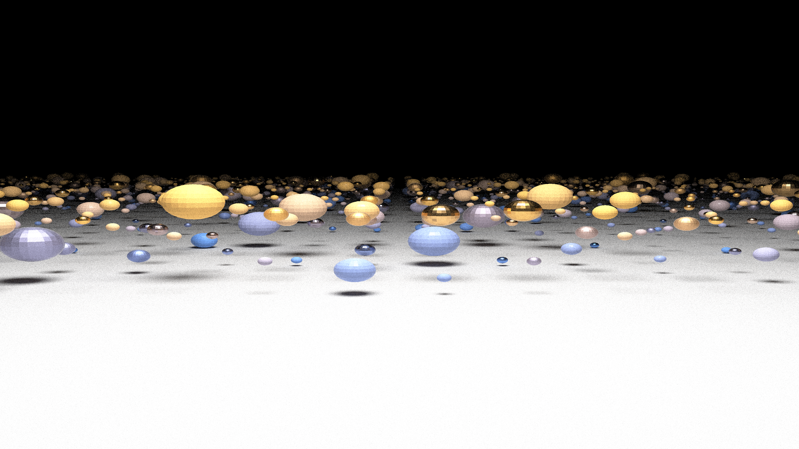
*2,500 instances (4 size tiers × 6 material kinds) — TLAS instancing at scale.*

## Furnace tests on glTF models

Real textured models path-traced under a uniform environment with no lights —
every pixel should converge to the environment intensity; any firefly or NaN
is a library bug.

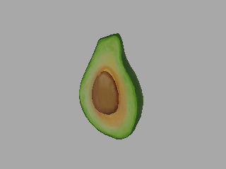
*Avocado — first scene-level furnace/NaN test.*

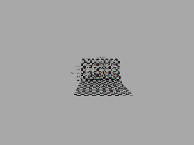
*DispersionTest — transmission + dispersion under furnace conditions.*

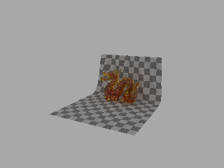
*DragonAttenuation — the scene that exposed (and now guards) the TIR-fallback pdf/eval anisotropy mismatch.*

## Ray casting

*Corner-tunneling regression — rays with tMin=0 escaping through shared BLAS edges.*

*Shadow-acne / self-intersection check.*

## Microfacet foundations (GGX, Smith, Fresnel)

*GGX distribution over angle × roughness.*

*Smith G1 masking term.*

*Smith height-correlated visibility (G2).*

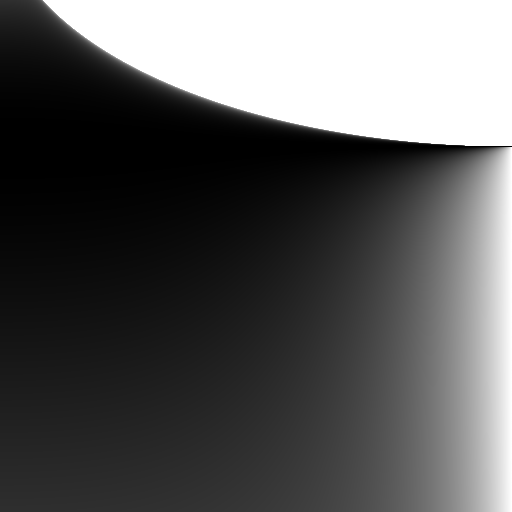
*Dielectric Fresnel over incidence × IOR.*

*F82 metallic Fresnel, untinted.*

*F82 metallic Fresnel with gold edge tint.*

*Directional albedo over incidence × roughness (energy-compensation input).*

*Kulla–Conty energy-compensation lookup table.*

*Analytic energy-compensation reference.*

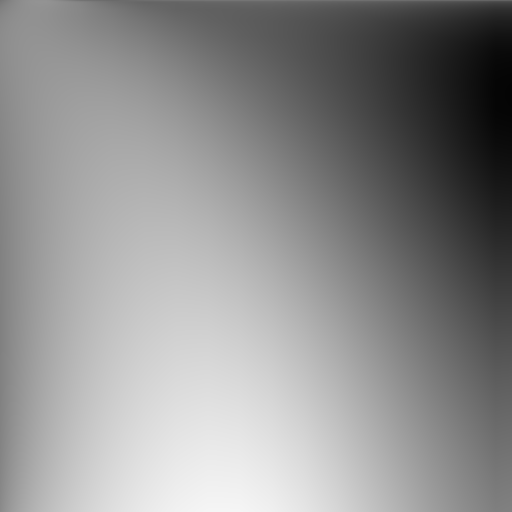
*Table vs. analytic difference.*

## Sampling — bounded GGX VNDF

Chi-square sampler-vs-pdf verification (Eto & Tokuyoshi 2023 bounded sampler);
red pixels in NaN sweeps mark non-finite output — none present.

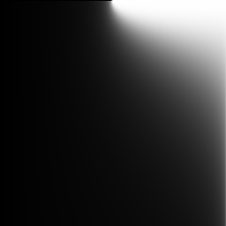
*Plain VNDF sampler NaN sweep.*

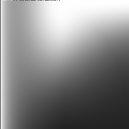
*Bounded sampler NaN sweep, isotropic.*

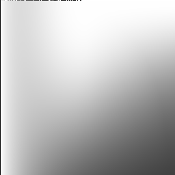
*Bounded sampler NaN sweep, anisotropic.*

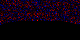
*Chi-square residual, isotropic — noise only, no structured bias.*

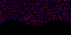
*Chi-square residual, anisotropic.*

*Pdf sphere-integral — uniform 1.0 after the below-horizon support fix.*

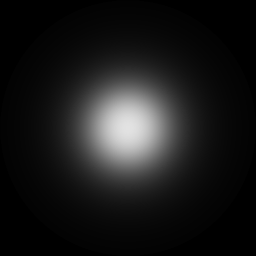
*Sampler support footprint, isotropic control.*

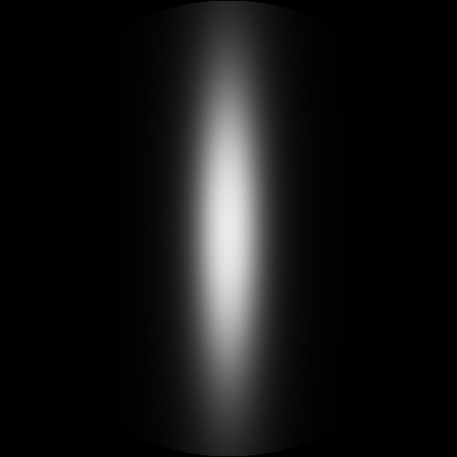
*Sampler support footprint, anisotropic.*

*Dielectric specular lobe support footprint.*

## EON diffuse lobe

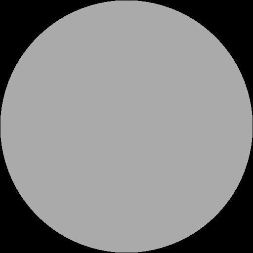
*EON BRDF disk at σ=0 — reduces to Lambert.*

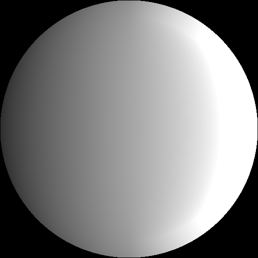
*EON BRDF disk at high roughness.*

*Difference vs. an independent MaterialX EON port.*

*EON energy-compensation term.*

*Energy-compensation fit error.*

*EON furnace (energy conservation) over roughness × incidence.*

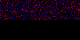
*Diffuse sampler chi-square residual.*

## Glossy-diffuse lobe

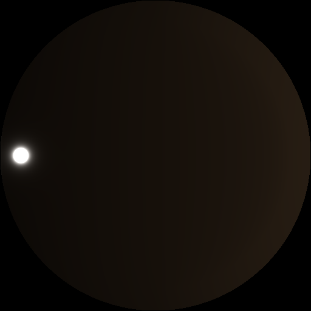
*BRDF disk, smooth coat.*

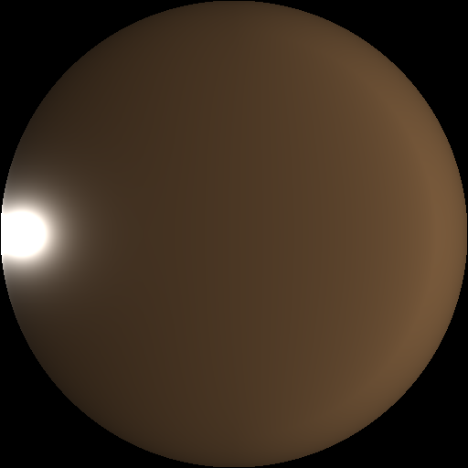
*BRDF disk, medium roughness.*

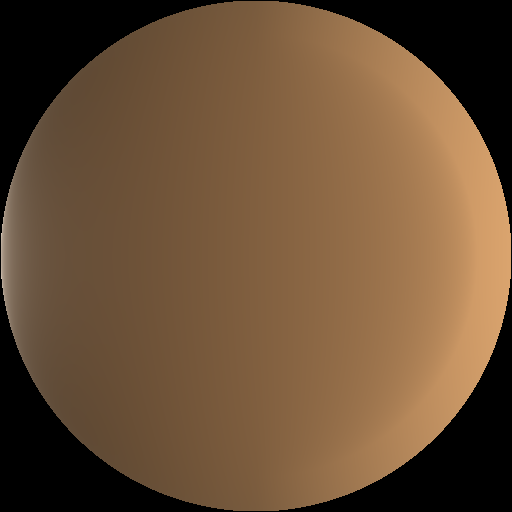
*BRDF disk, rough.*

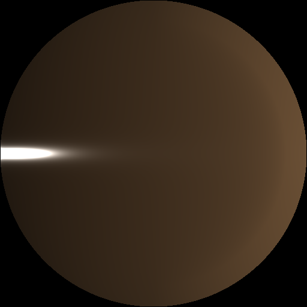
*BRDF disk, anisotropic.*

*Furnace heatmap, roughness × incidence.*

*Furnace heatmap, roughness × IOR.*

*Furnace heatmap, roughness × anisotropy.*

## Metallic lobe

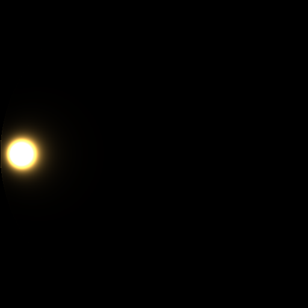
*BRDF disk, smooth.*

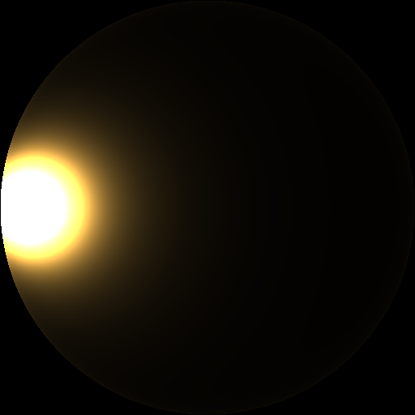
*BRDF disk, medium roughness.*

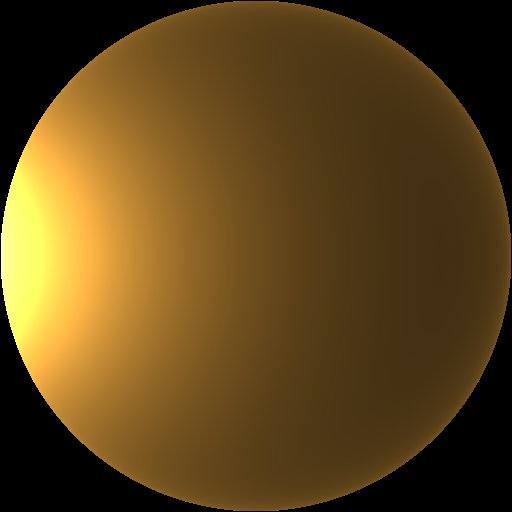
*BRDF disk, rough.*

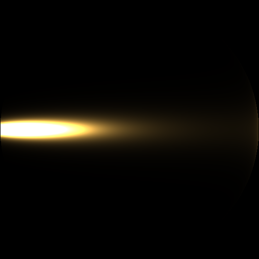
*BRDF disk, anisotropic.*

*Furnace heatmap, roughness × incidence.*

*Furnace heatmap, roughness × anisotropy.*

*Furnace heatmap, incidence × base-color tint.*

## Fuzz lobe (Zeltner LTC sheen)

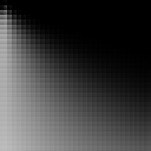
*Zeltner LTC coefficient LUT (R channel).*

*Evaluate NaN sweep — red would mark non-finite output.*

*Sampler NaN sweep, fuzzB < 0.*

*Sampler NaN sweep, fuzzB = 0.*

*Sampler NaN sweep, fuzzB > 0 — includes below-horizon incidence.*

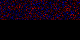
*Chi-square residual, negative fuzzB.*

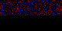
*Chi-square residual, positive fuzzB.*

*Pdf sphere-integral — uniform 1.0 across incidence × fuzzA.*

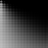
*Fuzz furnace heatmap.*

## Transmission lobe

Rough-dielectric BTDF with VNDF refraction and TIR fallback — verification
found and fixed a half-vector-Jacobian sign bug and a matched-IOR NaN.

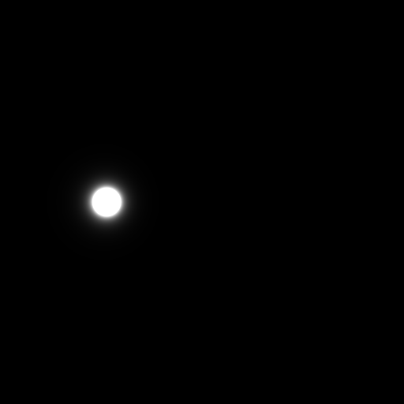
*BTDF disk, smooth — tight Snell-bent lobe.*

*BTDF disk, medium roughness.*

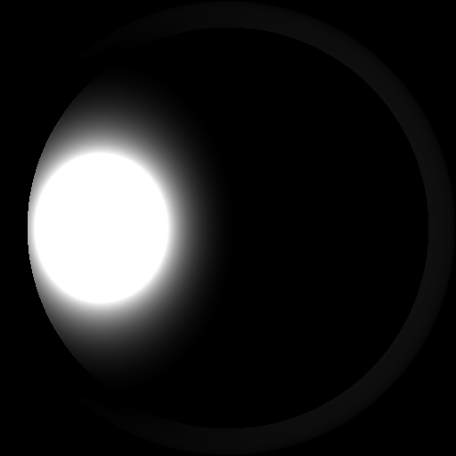
*BTDF disk, rough — frosted-glass spread.*

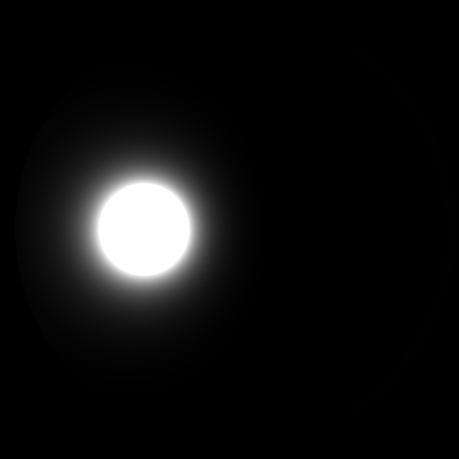
*BTDF disk, high IOR.*

*Evaluate sweep, entering the medium.*

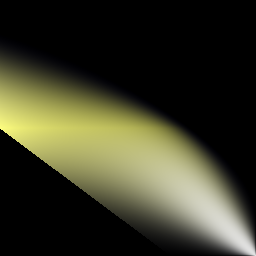
*Evaluate sweep, exiting the medium.*

*Evaluate sweep at matched IOR — the case that used to NaN.*

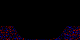
*Chi-square residual, entering rays.*

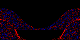
*Chi-square residual, exiting rays.*

*Transmission furnace heatmap.*

*Dispersion — per-wavelength IOR spread.*

*NaN sweep, entering.*

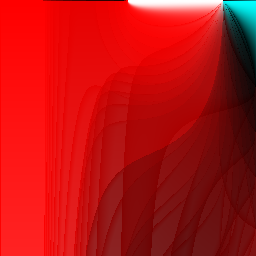
*NaN sweep, exiting.*

*NaN sweep, exiting at diamond IOR.*

*NaN sweep at matched IOR.*

## Thin-film interference

*Iridescent BRDF disk with thin-film active.*

*Iridescent color over thickness × incidence.*

*Iridescent color over thickness × film IOR.*

*Energy boundedness over thickness × incidence.*

*NaN sweep at grazing incidence over conductor kappa.*

## Multi-lobe mixture

Pairwise chi-square residuals — standardized (observed − expected)/√E over a
sphere-bin grid, one image per incidence angle (cosθ 0.15 / 0.5 / 0.9). This
suite caught the TIR-reflect-pdf double-counting bug against specular.

*Diffuse + specular, grazing.*

*Diffuse + specular, mid incidence.*

*Diffuse + specular, near normal.*

*Coat + specular, grazing.*

*Coat + specular, mid incidence.*

*Coat + specular, near normal.*

*Fuzz + diffuse, grazing.*

*Fuzz + diffuse, mid incidence.*

*Fuzz + diffuse, near normal.*

*Transmission + specular, grazing — the pairing that exposed the TIR pdf bug.*

*Transmission + specular, mid incidence.*

*Transmission + specular, near normal.*

*All lobes live at once, grazing.*

*All lobes, mid incidence.*

*All lobes, near normal.*

## Infrastructure checks

*RNG uniformity along a single sample chain (u64 stream).*

*RNG decorrelation across pixels.*

*Shading-frame orthogonality error across the sphere of normals.*
